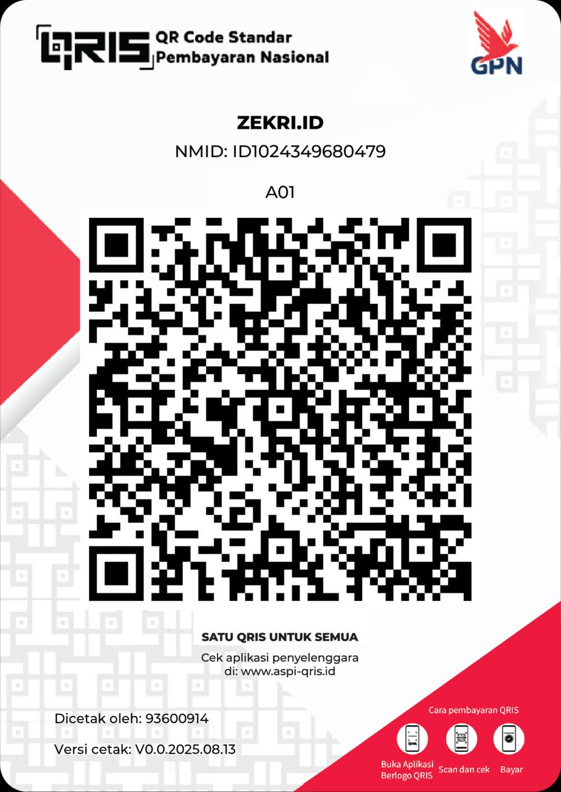

# Polytron EV - Official Android App Releases

Selamat datang di repositori resmi untuk distribusi aplikasi **Polytron EV**. Repositori ini digunakan khusus untuk rilis aplikasi Android agar memudahkan pengguna mendapatkan versi terbaru secara langsung.

## 📱 Cara Mengunduh & Instalasi

1.  Buka halaman **[Releases](https://github.com/zexry619/pev-app-release/releases)** pada repositori ini.
2.  Cari versi terbaru (paling atas).
3.  Di bagian **Assets**, klik pada file `app-release.apk` untuk mengunduh.
4.  Setelah unduhan selesai, buka file tersebut di perangkat Android Anda untuk memulai instalasi.
    *   *Catatan: Anda mungkin perlu mengaktifkan izin "Install from Unknown Sources" di pengaturan perangkat Anda.*

## ✨ Fitur Aplikasi

- **Monitoring Kendaraan**: Pantau status baterai dan kesehatan motor secara real-time.
- **Peta Pengisian Daya**: Temukan stasiun pengisian terdekat dengan mudah.
- **Analitik & Riwayat**: Lihat detail perjalanan dan analitik penggunaan kendaraan Anda.

## 🛠️ Informasi Tambahan

- **Source Code**: Kode sumber aplikasi ini bersifat privat untuk keperluan internal. Repositori ini hanya digunakan untuk jalur distribusi (build).
- **Kontribusi**: Jika Anda adalah kontributor resmi, silakan hubungi tim pengembang melalui sistem internal kami.
- **Kontak & Dukungan**: Jika ada masalah terkait aplikasi, silakan hubungi melalui [me@zekri.id](mailto:me@zekri.id).

## ☕ Dukungan & Donasi

Pengembangan aplikasi ini dilakukan secara mandiri oleh komunitas. Bagi yang ingin mendukung atau **berdonasi** untuk biaya server dan pengembangan fitur baru, bisa scan QRIS di bawah ini:

---
*Dibuat Oleh Komunitas PEV RIDER Indonesia.*
